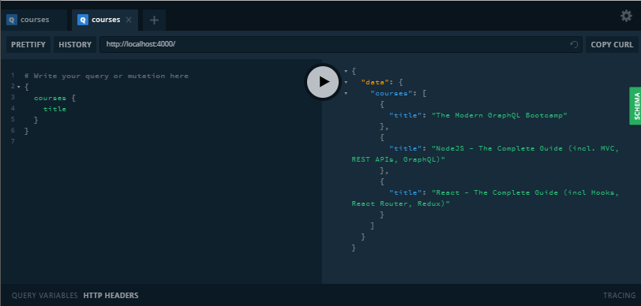

# apollo-server-template

Apollo Server Template



[](https://travis-ci.org/edufrojo/apollo-server-template)
[](https://david-dm.org/edufrojo/apollo-server-template)
[](https://david-dm.org/edufrojo/apollo-server-template?type=dev)
[](https://scrutinizer-ci.com/g/edufrojo/apollo-server-template/?branch=master)
[](http://hits.dwyl.io/edufrojo/apollo-server-template)

## Despliegue

Descargar el repositorio:

```sh
git clone https://github.com/edufrojo/apollo-server-template.git
```

Instalar las dependencias:

```sh
npm install

```

Habilitar el servidor y acceder a 'localhost:4000':

```sh
npm start

```

## Licencia

[](https://github.com/edufrojo/apollo-server-template/blob/master/LICENSE)

En la medida de lo posible según la ley, [Eduardo Fernández](https://edufrojo.dev) ha renunciado a todos los derechos de autor y derechos conexos o relacionados a este trabajo.
